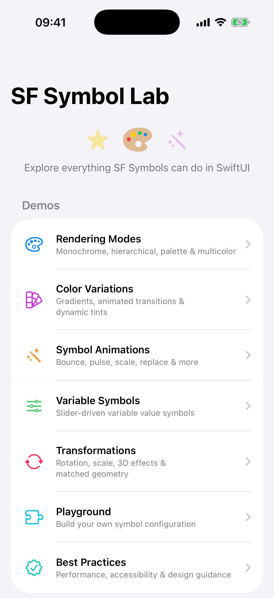
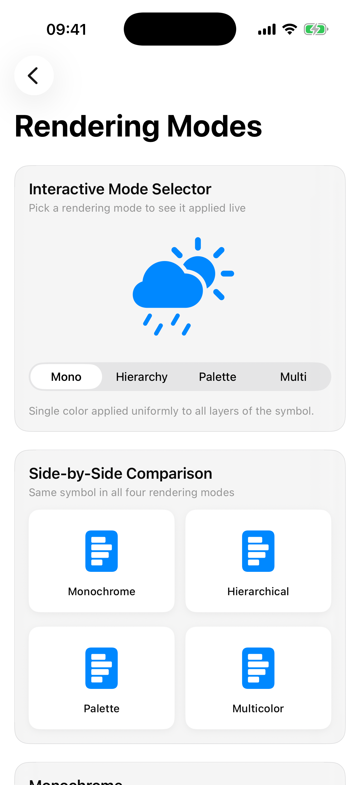
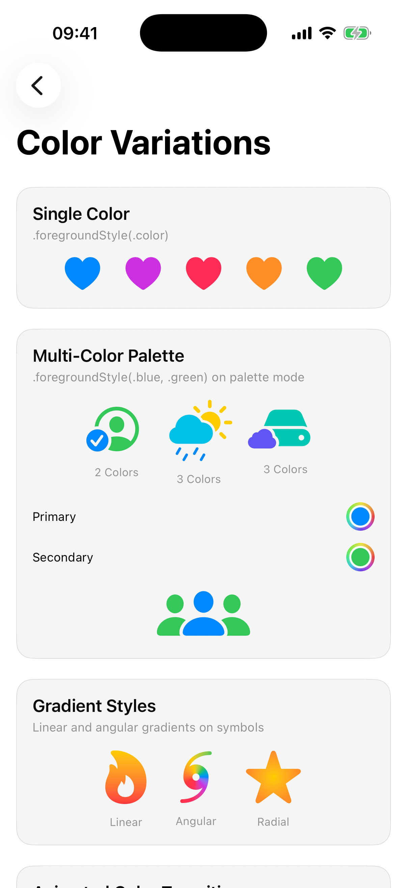
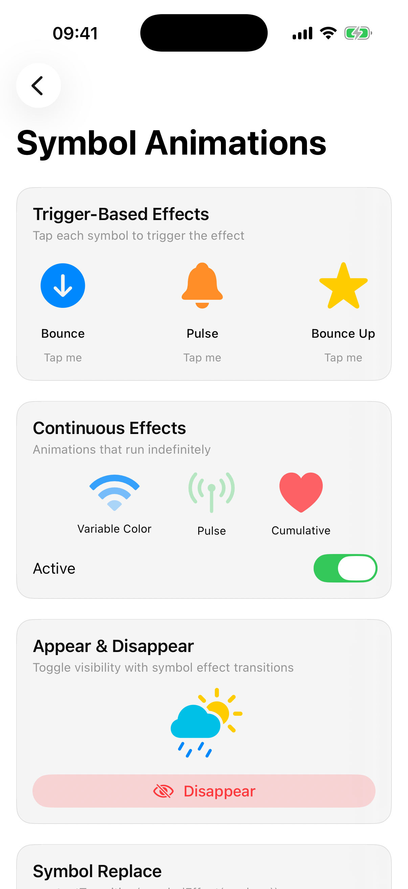
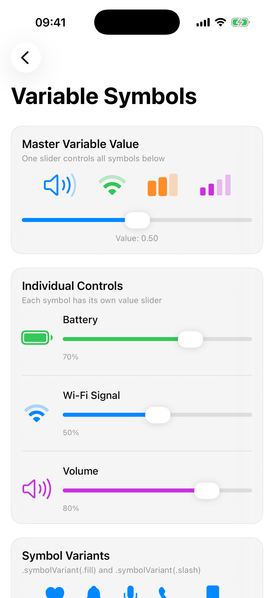
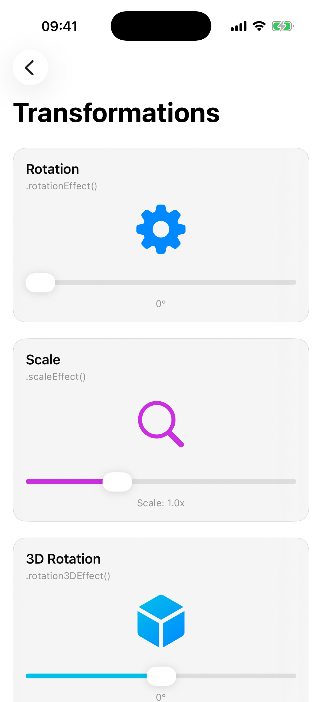
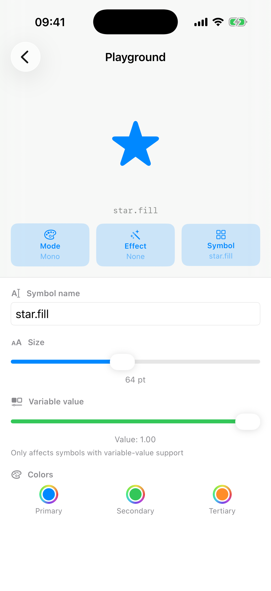
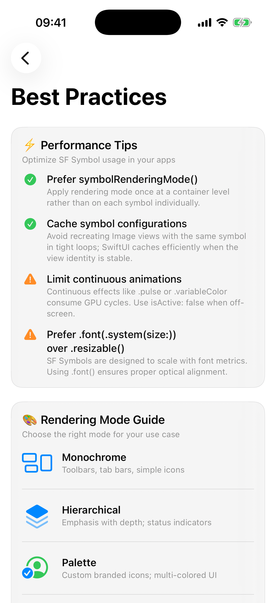

# SF Symbol Lab

> An interactive SwiftUI showcase demonstrating advanced SF Symbols usage on iOS 17+.

[](https://github.com/blerdfoniqi/SFSymbolLab/actions/workflows/ci.yml)


## ✨ Features

| Section | What It Covers |
|---------|---------------|
| **Rendering Modes** | Monochrome, hierarchical, palette, multicolor — side-by-side comparison and an interactive picker |
| **Color Variations** | Single color, multi-color palette, linear / angular / radial gradients, animated transitions, tap-to-cycle colors |
| **Symbol Animations** | Bounce, pulse, scale, variableColor, appear / disappear, replace — trigger-based, continuous, and combined effects |
| **Variable Symbols** | Slider-driven variable values for battery, wifi, speaker; `.symbolVariant(.fill/.slash)` toggles; variable color effects |
| **Transformations** | 2D rotation, scaling, 3D rotation, opacity, `matchedGeometryEffect`, combined transforms with Reset button |
| **Playground** | Type any symbol name → pick rendering mode → choose colors → apply animation → adjust size & variable value — all live |
| **Best Practices** | Performance tips, rendering mode selection guide, accessibility labels & VoiceOver, Dynamic Type scaling, dark mode |

## 📸 Screenshots

|  |  |  |
|:--:|:--:|:--:|
|  |  |  |
| **Home** | **Rendering Modes** | **Color Variations** |
|  |  |  |
| **Animations** | **Variable Symbols** | **Transformations** |
|  |  |  |
| **Playground** | **Best Practices** |  |

> Regenerate with `Scripts/capture_screenshots.sh` (see [CONTRIBUTING](CONTRIBUTING.md)).

## 🏗 Architecture

- **SwiftUI** with `NavigationStack` (no Storyboards)
- **State-driven**: local view state via `@State`; value-based `NavigationStack` routing
- **Modular file structure**:

```
SFSymbolLab/
├── Models/
│   ├── DemoSection.swift          # Navigation enum
│   ├── RenderingModeOption.swift   # Rendering mode metadata
│   └── AnimationEffectOption.swift # Animation effect metadata
├── Components/
│   ├── DemoCard.swift             # Reusable card container
│   ├── DemoScrollView.swift       # Scrollable screen scaffold
│   ├── SliderControl.swift        # Labeled slider with value formatting
│   ├── SymbolShowcaseItem.swift   # Symbol + caption cell
│   └── TipRow.swift               # Icon + title + detail guideline row
├── Views/
│   ├── RenderingModesView.swift
│   ├── ColorVariationsView.swift
│   ├── SymbolAnimationsView.swift
│   ├── VariableSymbolsView.swift
│   ├── SymbolTransformationsView.swift
│   ├── PlaygroundView.swift
│   └── BestPracticesView.swift
├── ContentView.swift              # Root NavigationStack
└── SFSymbolLabApp.swift           # App entry point
```

## 📋 Requirements

- **Xcode 16+** (project uses synchronized file groups)
- **iOS 17.0+** — also builds for iPadOS, macOS 14+, and visionOS
- No third-party dependencies

## 🚀 Getting Started

1. Open `SFSymbolLab.xcodeproj` in Xcode
2. Select an iOS 17+ simulator
3. Build & Run (⌘R)

All previews are included — use the Xcode Canvas for quick visual checks.

## 🔑 Key APIs Demonstrated

| API | Section |
|-----|---------|
| `.symbolRenderingMode()` | Rendering Modes |
| `.foregroundStyle(_:_:_:)` | Rendering Modes, Colors |
| `LinearGradient` / `AngularGradient` / `RadialGradient` | Color Variations |
| `.symbolEffect(.bounce/.pulse/.scale)` | Animations |
| `.symbolEffect(.variableColor)` | Animations, Variable Symbols |
| `.contentTransition(.symbolEffect(.replace))` | Animations |
| `.transition(.symbolEffect(.appear))` | Animations |
| `Image(systemName:variableValue:)` | Variable Symbols |
| `.symbolVariant(.fill/.slash)` | Variable Symbols |
| `.rotationEffect()` / `.rotation3DEffect()` | Transformations |
| `.scaleEffect()` / `.opacity()` | Transformations |
| `.matchedGeometryEffect()` | Transformations |
| `.accessibilityLabel()` / `.accessibilityHidden()` | Best Practices |

## 🧪 Testing

Unit tests use **Swift Testing** and live in `SFSymbolLabTests/`, covering the model enums (`DemoSection`, `RenderingModeOption`, `AnimationEffectOption`).

Run in Xcode with **⌘U**, or from the command line:

```bash
xcodebuild test \
  -project SFSymbolLab.xcodeproj \
  -scheme SFSymbolLab \
  -destination 'platform=iOS Simulator,name=iPhone 16'
```

GitHub Actions builds and runs the suite on every push and PR to `main` — see [.github/workflows/ci.yml](.github/workflows/ci.yml).

## 📄 License

MIT — use freely for learning, demos, and technical interviews. See [LICENSE](LICENSE).
